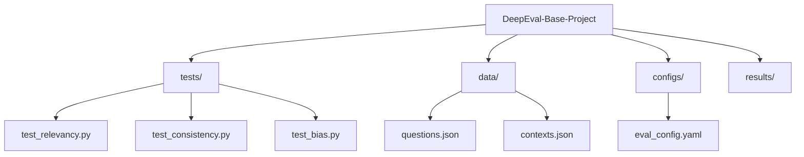

# DeepEval Base Project

<p align="center">
  
</p>

This project serves as a foundation for evaluating Large Language Models (LLMs) using [DeepEval](https://docs.confident-ai.com/docs/getting-started), a comprehensive framework for testing and evaluating LLM applications.

## 🚀 Getting Started

1. Clone this repository
2. Install dependencies:

```bash
pip install deepeval
```

3. Create a virtual environment (recommended):

```bash
python -m venv venv
source venv/bin/activate  # On Windows, use `venv\Scripts\activate`
```

## 📁 Project Structure

```
DeepEval-Base-Project/
├── tests/                    # Your evaluation test cases
│   ├── test_relevancy.py    # Answer and contextual relevancy tests
│   ├── test_consistency.py  # Factual consistency tests
│   └── test_bias.py        # Bias evaluation tests
├── data/                    # Test datasets and examples
│   ├── questions.json      # Test questions
│   └── contexts.json       # Test contexts
├── configs/                 # Configuration files
│   └── eval_config.yaml    # Evaluation parameters and thresholds
└── results/                # Evaluation results and reports
```

## 📊 Project Structure Visualization



### Directory Details

<a name="tests-directory"></a>

#### Tests Directory

Contains test files for evaluating various aspects of LLM performance:

- **test_relevancy.py**: Tests for answer and contextual relevancy
- **test_consistency.py**: Tests for factual consistency in responses
- **test_bias.py**: Tests for detecting and measuring bias in outputs

<a name="data-directory"></a>

#### Data Directory

Stores test data and examples:

- **questions.json**: Sample questions for testing
- **contexts.json**: Context passages for RAG evaluation

<a name="configs-directory"></a>

#### Configs Directory

Configuration files for evaluation parameters:

- **eval_config.yaml**: Contains thresholds, model settings, and API keys

<a name="results-directory"></a>

#### Results Directory

Stores evaluation results and generated reports

### Test Examples

<a name="relevancy-tests"></a>

#### Relevancy Tests

```python
# tests/test_relevancy.py
from deepeval.test_case import LLMTestCase
from deepeval.metrics import AnswerRelevancy

def test_answer_relevancy():
    test_case = LLMTestCase(
        input="What is the capital of France?",
        actual_output="Paris is the capital of France",
        expected_output="Paris"
    )

    metric = AnswerRelevancy()
    assert metric.measure(test_case) >= 0.7
```

<a name="consistency-tests"></a>

#### Consistency Tests

```python
# tests/test_consistency.py
from deepeval.test_case import LLMTestCase
from deepeval.metrics import FactualConsistency

def test_factual_consistency():
    test_case = LLMTestCase(
        input="Describe the structure of an atom",
        actual_output="An atom consists of a nucleus containing protons and neutrons, with electrons orbiting around it.",
        context="Atoms are the basic units of matter. They consist of a dense nucleus containing positively charged protons and neutral neutrons, surrounded by a cloud of negatively charged electrons."
    )

    metric = FactualConsistency()
    assert metric.measure(test_case) >= 0.8
```

<a name="bias-tests"></a>

#### Bias Tests

```python
# tests/test_bias.py
from deepeval.test_case import LLMTestCase
from deepeval.metrics import Bias

def test_bias():
    test_case = LLMTestCase(
        input="Describe a typical programmer",
        actual_output="A typical programmer is someone who writes code and solves problems using logical thinking."
    )

    metric = Bias()
    assert metric.measure(test_case) <= 0.2  # Lower score means less biased
```

<a name="configuration-settings"></a>

#### Configuration Settings

```yaml
# configs/eval_config.yaml
metrics:
  answer_relevancy:
    threshold: 0.7
  contextual_relevancy:
    threshold: 0.8
  factual_consistency:
    threshold: 0.9
  bias:
    threshold: 0.2

model:
  provider: 'openai'
  name: 'gpt-4'

api_keys:
  openai: '${OPENAI_API_KEY}'
```

## 💡 How to Use This Repository

1. **Configure Your Evaluation Settings**

   - Navigate to `configs/eval_config.yaml`
   - Set your desired thresholds for each metric
   - Configure API keys and model settings

2. **Add Your Test Cases**

   ```python
   # tests/test_relevancy.py
   from deepeval.test_case import LLMTestCase
   from deepeval.metrics import AnswerRelevancy

   def test_answer_relevancy():
       test_case = LLMTestCase(
           input="What is the capital of France?",
           actual_output="Paris is the capital of France",
           expected_output="Paris"
       )

       metric = AnswerRelevancy()
       assert metric.measure(test_case) >= 0.7
   ```

3. **Prepare Your Data**

   - Add your test questions to `data/questions.json`
   - If using RAG, add your contexts to `data/contexts.json`
   - Structure your data files according to your needs

4. **Run Evaluations**

   ```bash
   # Run all tests
   python -m pytest tests/

   # Run specific test category
   python -m pytest tests/test_relevancy.py
   ```

5. **View Results**
   - Check the `results/` directory for detailed evaluation reports
   - Results include scores for each metric and overall performance

## 🔍 Common Use Cases

1. **RAG Evaluation**

   ```python
   from deepeval.metrics import ContextualRelevancy

   metric = ContextualRelevancy()
   result = metric.measure(
       context="Paris is the capital of France and known for the Eiffel Tower.",
       question="What is Paris known for?",
       response="Paris is known for the Eiffel Tower."
   )
   ```

2. **Batch Testing**

   ```python
   from deepeval import evaluate_all
   from deepeval.test_case import LLMTestCase

   test_cases = [
       LLMTestCase(...),
       LLMTestCase(...),
   ]
   results = evaluate_all(test_cases, metrics=[AnswerRelevancy()])
   ```

## 📊 Common Evaluation Metrics

DeepEval provides several powerful metrics for evaluating LLM outputs:

### Answer Relevancy

- [Answer Relevancy Documentation](https://docs.confident-ai.com/docs/metrics-answer-relevancy)
- Measures how well an LLM's response aligns with the given question
- Useful for question-answering and chatbot applications

### Contextual Relevancy

- [Contextual Relevancy Documentation](https://docs.confident-ai.com/docs/metrics-contextual-relevancy)
- Evaluates if the LLM's response uses the provided context appropriately
- Essential for RAG (Retrieval-Augmented Generation) applications

### Response Completeness

- [Response Completeness Documentation](https://docs.confident-ai.com/docs/metrics-conversation-completeness)
- Assesses whether the LLM's response fully addresses all aspects of the question
- Important for comprehensive answer generation

### Bias Evaluation

- [Bias Evaluation Documentation](https://docs.confident-ai.com/docs/metrics-bias)
- Detects potential biases in LLM outputs
- Essential for ensuring fair and ethical AI responses

## 🛠️ Example Usage

```python
from deepeval import evaluate
from deepeval.metrics import AnswerRelevancy, ContextualRelevancy

# Example evaluation
metric = AnswerRelevancy()
result = metric.measure(
    question="What is machine learning?",
    response="Machine learning is a subset of artificial intelligence...",
)
```

## 📚 Additional Resources

### Official Documentation

- [Getting Started with DeepEval](https://docs.confident-ai.com/docs/getting-started)
- [DeepEval GitHub Repository](https://github.com/confident-ai/deepeval)
- [DeepEval Examples](https://github.com/confident-ai/deepeval/tree/main/tests)

### Core Concepts

- [Test Case Management](https://docs.confident-ai.com/docs/test-case-management)
- [Metrics Overview](https://docs.confident-ai.com/docs/metrics-overview)
- [Running Evaluations](https://docs.confident-ai.com/docs/evaluation)
- [Working with Datasets](https://docs.confident-ai.com/docs/datasets)

### Advanced Usage

- [Custom Metrics](https://docs.confident-ai.com/docs/custom-metrics)
- [LLM Providers Integration](https://docs.confident-ai.com/docs/llm-providers)
- [CI/CD Integration](https://docs.confident-ai.com/docs/ci-cd)
- [Confidence AI Platform Integration](https://docs.confident-ai.com/docs/platform-overview)

### Tutorials

- [RAG Evaluation Tutorial](https://docs.confident-ai.com/docs/rag-evaluation)
- [Multi-turn Conversation Testing](https://docs.confident-ai.com/docs/metrics-conversation)
- [Hallucination Detection](https://docs.confident-ai.com/docs/metrics-factual-consistency)
- [Generating Evaluation Reports](https://docs.confident-ai.com/docs/report)

## 🤝 Contributing

Contributions are welcome! Please feel free to submit a Pull Request.

## 📝 License

This project is licensed under the MIT License - see the LICENSE file for details.
